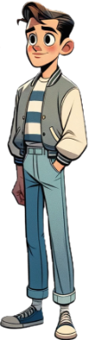
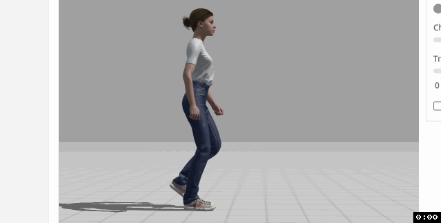

# WARNING

This is not finished yet.

Last updated: September 25, 2024

# ABOUT THE GAME

**Nausoleum** (nausea + mausoleum) is a haunted house simulator. It is about hiring **Undertakers** (monsters) to entertain the **Guests** of a haunted house.

## INSPIRATION

It is inspired by the real-life [Winchester Mystery House](https://en.wikipedia.org/wiki/Winchester_Mystery_House).

> Beginning around 1895, Winchester started appearing in newspapers. The articles in these local papers were filled with speculation about Winchester and the ongoing construction of her San Jose home. Her lack of interaction with neighbors and the known fact that her money came from the firearms industry fed into a superstitious narrative, despite large, ornate homes being commonly built by the wealthy. The newspapers declared that the reason that the construction was ongoing was that Winchester feared she would have bad luck if the construction would stop. This theory eventually grew into stories that she believed she would die if construction stopped.

> The belief that Winchester built her house in its strange, maze-like manner to confuse and keep spirits from harming her and that her sanity was questionable started in the mid-1890s and has grown in scale since her death. The doors and windows that open to nothing, the unusually shallow stairs, the stairs that end in a ceiling, interior barred windows and trap doors in the floor are used to confirm Winchester's spirituality and poor state of mind.

## UNDERTAKERS

Undertakers are monsters you hire to work at the Nausoleum. The player has a list of undertakers on the left side of the screen. Undertakers are drag-and-drop, and come to life on drop. Most of them are not human, but some form of monster.

## GUESTS

Guests are people from the outside world who have decided to enter the Nausoleum. Most of them are human.

# STYLE GUIDELINES

## REALISTIC PROPORTIONS

Every guest's body, limbs, and facial features follow natural human proportions. All characters should look grounded, as if they could exist in the real world, even within a stylized context.

## FLAT SHADING

While the proportions are realistic, the flat shading keeps the overall style within the realm of cartoons. This means the character doesn't have much depth or gradient shading, but relies on clean, bold color blocks. It makes the scene simple and readable, keeping it from veering into photorealism.

## CARTOON HORROR

The environment retains the cartoon fantasy horror feel, with stylized elements like twisted trees, eerie lighting, and spooky fog. The setting is clearly otherworldly, but the character looks more believable within it due to their more natural human proportions.

## SHAPES

Characters have sharp, clean lines that define their forms. Features like claws, teeth, and bone structures are more pronounced to give them a slightly intense, intimidating edge, especially for creatures like the werewolf or skeleton.

Softer shapes are used for certain characters to convey innocence or vulnerability, in contrast with the more angular, menacing forms of the creatures.

## TEXTURES

Sleek and Simplified: Textures are subtle, and surfaces like fur, skin, or fabric appear clean and polished, though they still give a hint of wear, especially in elements like the werewolf's fur or the vampire's clothing.

Stylized Wear and Tear: Though characters may wear torn or worn clothing, the texture remains simplified, suggesting age and decay without overwhelming the flat-shaded aesthetic.

## COLOR PALETTE

Cool Backgrounds, Warm Contrasts: The overall tone of the environment relies heavily on cool colors—purples, blues, and greens—to evoke a spooky, eerie atmosphere. Characters, particularly the human ones, wear outfits in warmer colors like reds and oranges, helping them stand out against the gloomy setting.

Subdued and Muted Tones: Colors are slightly desaturated, giving a spooky, melancholic feel. Brightness is reserved for focal points like character expressions or key interactive objects in the environment.

## ENVIRONMENT

The backgrounds are typically more minimalistic but still carry enough detail to be immersive. Trees may be twisted, and objects like lanterns or buildings show signs of wear and decay.

Eerie Atmosphere: The use of mist, dark forests, or ruins in the environment suggests mystery and horror but is kept simple enough to keep the focus on the characters.

# TECHNICAL GUIDELINES

## IMAGE SIZES

| | width | height |
| ------------ | ----- | ------ |
| viewport | 1920 | 1080 |
| environment | 1920 | 1080 |
| UI - sidebar | 256 | 980 |
| UI - icons | 50 | 50 |
| guests | 300 | 900 |

## FORMAT

Export in both .psd and .png

# FIRST LEVEL REQUIREMENTS

## CONCEPT ART

### MAINSTREAM MARK

An average American teenager dressed in street clothes.

### SKELLY ARM

A skeleton arm that bursts out of the ground.

## ANIMATIONS

### MAINSTREAM MARK

#### HAPPY STRUT

#### SLOW TURN

Change direction while walking.

#### RUNNING AND SCREAMING

Arms are up and flailing.

#### QUICK TURN

Change direction while running.

### SKELLY ARM

- Animation - Ground Pop

- The arm should start out buried under a pile of dirt, and pop out of the ground.

## ENVIRONMENTS

### NAUSOLEUM INTERIOR BACKGROUND

Should look like the interior of a mausoleum.

### NORMAL FLOOR TILE

- Open to change angle / perspective.

### ENTER/EXIT DOOR

## UI

### SIDEBAR

### ICONS

#### SCREAM

#### RECALL ICON

#### SKELLY ARM ICON

# MILESTONES

| milestone | due   |
| --------- | ----- |
| 1         | 10/16 |
| 2         | 10/31 |
| 3         |       |
| 4         |       |
| 5         |       |
| 6         |       |
| 7         |       |

# DELIVERABLES

|subject|type|format|milestone|
|---|---|---|---|
|Door|Concept Art|png|1|
|Interior Background|Concept Art|png|1|
|Mainstream Mark|Concept Art|png|1|
|Skelly Arm|Concept Art|png|1|
|Tile|Concept Art|png|1|
|Scream Icon|Icon|png and psd|1|
|Mainstream Mark|Character Turnaround|png|2|
|Skelly Arm|Character Turnaround|png|2|
|Door|Rough Layout & Composition|png|2|
|Interior Background|Rough Layout & Composition|png|2|
|Tile|Rough Layout & Composition|png|2|
|Door|Clean Line Art|png|3|
|Interior Background|Clean Line Art|png|3|
|Mainstream Mark|Clean Line Art|png|3|
|Skelly Arm|Clean Line Art|png|3|
|Tile|Clean Line Art|png|3|
|Door|Coloring and Shading|png and psd|4|
|Interior Background|Coloring and Shading|png and psd|4|
|Mainstream Mark|Coloring and Shading|png and psd|4|
|Skelly Arm|Coloring and Shading|png and psd|4|
|Tile|Coloring and Shading|png and psd|4|
|Mainstream Mark|Animation - Calm and Walking|png sprite sheet|5|
|Mainstream Mark|Animation - Change direction running|png sprite sheet|5|
|Mainstream Mark|Animation - Change direction walking|png sprite sheet|5|
|Skelly Arm|Animation - Ground Pop|png sprite sheet|5|
|Skelly Arm|Animation - OK Sign|png sprite sheet|5|
|Mainstream Mark|Animation - Running and Screaming|png sprite sheet|5|
|Skelly Arm|Animation - Thumbs Up|png sprite sheet|5|
|Mainstream Mark|Animation - Vomit|png sprite sheet|5|
|User Interface - Sidebar|Concept Art|png and psd|6|
|User Interface - Skelly Arm|Icon|png and psd|6|
|User Interface - Undo Button|Icon|png and psd|6|
