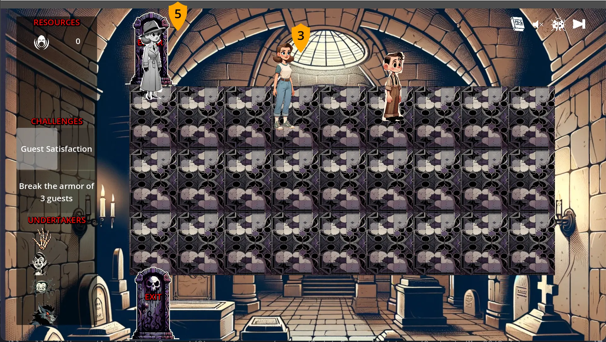

# ---WARNING---

**This is not finished yet.**

Last updated: September 25, 2024

# FIRST LEVEL REQUIREMENTS

## CONCEPT ART

### MAINSTREAM MARK

An average American teenager dressed in street clothes.

### SKELLY ARM

A skeleton arm that bursts out of the ground.

## ANIMATIONS

### MAINSTREAM MARK

#### HAPPY STRUT

#### SLOW TURN

Change direction while walking.

#### RUNNING AND SCREAMING

Arms are up and flailing.

#### QUICK TURN

Change direction while running.

### SKELLY ARM

#### ANIMATION - GROUND POP

The arm should start out buried under a pile of dirt, and pop out of the ground.

## ENVIRONMENTS

### NAUSOLEUM INTERIOR BACKGROUND

Should look like the interior of a mausoleum.

### NORMAL FLOOR TILE

The floor is currently 9 (width) x 3 (height). I would like to make this taller -- 5 height, which means the tiles might need to be smaller or of a different perspective.

### ENTER/EXIT DOOR

## UI

### SIDEBAR

### ICONS

#### SCREAM

#### RECALL ICON

#### SKELLY ARM ICON

# MILESTONES

| milestone | due   |
| --------- | ----- |
| 1         | 10/16 |
| 2         | 10/31 |
| 3         |       |
| 4         |       |
| 5         |       |
| 6         |       |
| 7         |       |

# DELIVERABLES

| subject                                    | type                       | format           | milestone |
| ------------------------------------------ | -------------------------- | ---------------- | --------- |
| Door                                       | Concept Art                | png              | 1         |
| Interior Background                        | Concept Art                | png              | 1         |
| Mainstream Mark                            | Concept Art                | png              | 1         |
| Skelly Arm                                 | Concept Art                | png              | 1         |
| Tile                                       | Concept Art                | png              | 1         |
| Scream Icon                                | Icon                       | png and psd      | 1         |
| Mainstream Mark                            | Character Turnaround       | png              | 2         |
| Skelly Arm                                 | Character Turnaround       | png              | 2         |
| Door                                       | Rough Layout & Composition | png              | 2         |
| Interior Background                        | Rough Layout & Composition | png              | 2         |
| Tile                                       | Rough Layout & Composition | png              | 2         |
| Door                                       | Clean Line Art             | png              | 3         |
| Interior Background                        | Clean Line Art             | png              | 3         |
| Mainstream Mark                            | Clean Line Art             | png              | 3         |
| Skelly Arm                                 | Clean Line Art             | png              | 3         |
| Tile                                       | Clean Line Art             | png              | 3         |
| Door                                       | Coloring and Shading       | png and psd      | 4         |
| Interior Background                        | Coloring and Shading       | png and psd      | 4         |
| Mainstream Mark                            | Coloring and Shading       | png and psd      | 4         |
| Skelly Arm                                 | Coloring and Shading       | png and psd      | 4         |
| Tile                                       | Coloring and Shading       | png and psd      | 4         |
| Mainstream Mark - Happy strut              | Animation                  | png sprite sheet | 5         |
| Mainstream Mark - Change direction running | Animation                  | png sprite sheet | 5         |
| Mainstream Mark - Change direction walking | Animation                  | png sprite sheet | 5         |
| Mainstream Mark - Running and screaming    | Animation                  | png sprite sheet | 5         |
| Skelly Arm - Ground Pop                    | Animation                  | png sprite sheet | 5         |
| Skelly Arm - Thumbs Up                     | Animation                  | png sprite sheet | 5         |
| User Interface - Sidebar                   | Concept Art                | png and psd      | 6         |
| User Interface - Skelly Arm                | Icon                       | png and psd      | 6         |
| User Interface - Undo Button               | Icon                       | png and psd      | 6         |
