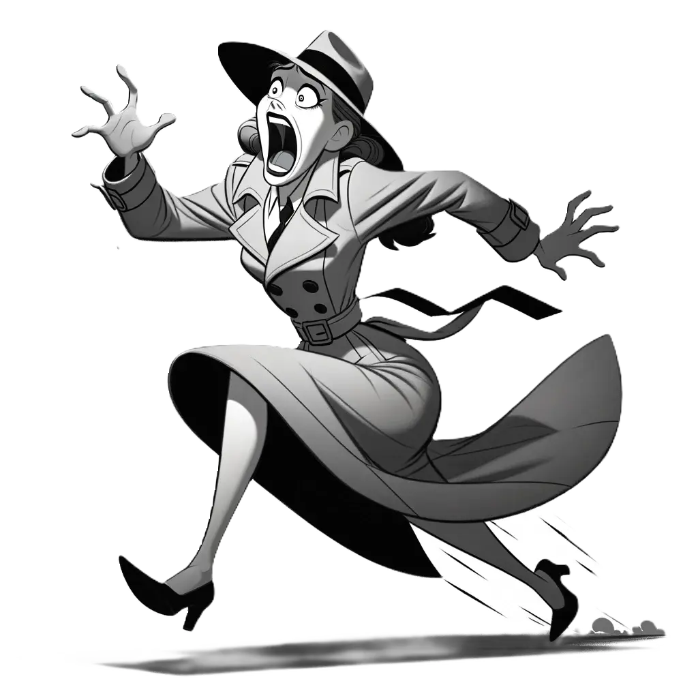
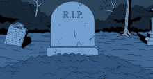
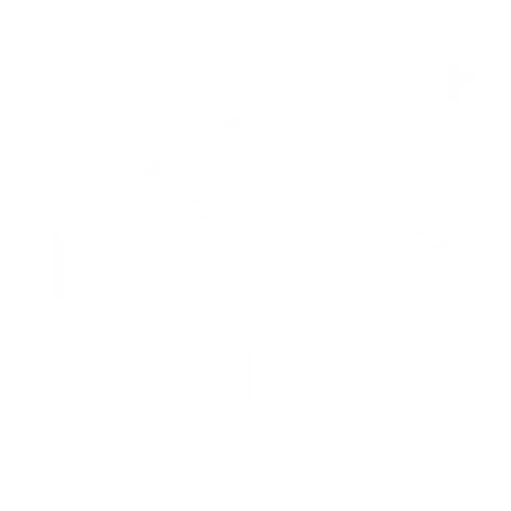

# FIRST LEVEL REQUIREMENTS

## CONCEPT ART

### MAINSTREAM MARK

An average American teenager dressed in street clothes. Should have three different outfits and hairstyles.

### SKELETON ARM

A skeleton arm that bursts out of the ground.

## ANIMATIONS

### MAINSTREAM MARK

#### HAPPY STRUT

#### SLOW TURN

Change direction while walking. The character's left leg and foot in the below animation is too stiff.

#### RUNNING AND SCREAMING

Arms are up and flailing. This should probably be split in half. The first half is starting to run while screaming, and the end is running while not screaming.

#### QUICK TURN

Change direction while running. The animation below is not great, but it is the general idea.

### SKELLY ARM

#### ANIMATION - GROUND POP

The arm should start out buried under a pile of dirt, and pop out of the ground.

## ENVIRONMENT

### NAUSOLEUM INTERIOR BACKGROUND

Should look like the interior of a mausoleum.

### NORMAL FLOOR TILE

The floor is currently 9 tiles by 3 tiles. I would like to make this taller -- 5 tiles tall, which means the tiles might need to be smaller or of a different perspective.

### EXPAND FLOOR TILE/ICON

Should either be a variation on the tile or an icon that clearly communicates more floor is being built.

### ENTER/EXIT DOOR

## UI

- Simple
- Easy to read
- Icons are currently white with a transparent background

### GAME WORLD

#### SCREAM ICON

Generated when a guest screams. Floats around the level until the player clicks it.

### SIDEBAR

#### SCREAM COUNTER ICON

#### SKELETON ARM ICON

Dragging and dropping the skeleton arm icon onto a tile deploys the skeleton arm.

#### RECALL ICON

Clicking the recall icon removes the undertaker (in this case the skeleton arm) from the game world.

# MILESTONES

| milestone | due         |
| --------- | ----------- |
| 1         | October 14  |
| 2         | October 31  |
| 3         | November 14 |
| 4         | November 31 |
| 5         | December 14 |
| 6         | December 31 |

# DELIVERABLES

| subject                                    | type                       | format           | milestone |
| ------------------------------------------ | -------------------------- | ---------------- | --------- |
| Door                                       | Concept Art                | png              | 1         |
| Interior Background                        | Concept Art                | png              | 1         |
| Mainstream Mark                            | Concept Art                | png              | 1         |
| Skelly Arm                                 | Concept Art                | png              | 1         |
| Tile                                       | Concept Art                | png              | 1         |
| Scream Icon                                | Icon                       | png and psd      | 1         |
| Mainstream Mark                            | Character Turnaround       | png              | 2         |
| Skelly Arm                                 | Character Turnaround       | png              | 2         |
| Door                                       | Rough Layout & Composition | png              | 2         |
| Interior Background                        | Rough Layout & Composition | png              | 2         |
| Tile                                       | Rough Layout & Composition | png              | 2         |
| Door                                       | Clean Line Art             | png              | 3         |
| Interior Background                        | Clean Line Art             | png              | 3         |
| Mainstream Mark                            | Clean Line Art             | png              | 3         |
| Skelly Arm                                 | Clean Line Art             | png              | 3         |
| Tile                                       | Clean Line Art             | png              | 3         |
| Door                                       | Coloring and Shading       | png and psd      | 4         |
| Interior Background                        | Coloring and Shading       | png and psd      | 4         |
| Mainstream Mark                            | Coloring and Shading       | png and psd      | 4         |
| Skelly Arm                                 | Coloring and Shading       | png and psd      | 4         |
| Tile                                       | Coloring and Shading       | png and psd      | 4         |
| Mainstream Mark - Happy strut              | Animation                  | png sprite sheet | 5         |
| Mainstream Mark - Change direction running | Animation                  | png sprite sheet | 5         |
| Mainstream Mark - Change direction walking | Animation                  | png sprite sheet | 5         |
| Mainstream Mark - Running and screaming    | Animation                  | png sprite sheet | 5         |
| Skelly Arm - Ground Pop                    | Animation                  | png sprite sheet | 5         |
| Skelly Arm - Thumbs Up                     | Animation                  | png sprite sheet | 5         |
| User Interface - Sidebar                   | Concept Art                | png and psd      | 6         |
| User Interface - Skelly Arm                | Icon                       | png and psd      | 6         |
| User Interface - Undo Button               | Icon                       | png and psd      | 6         |
