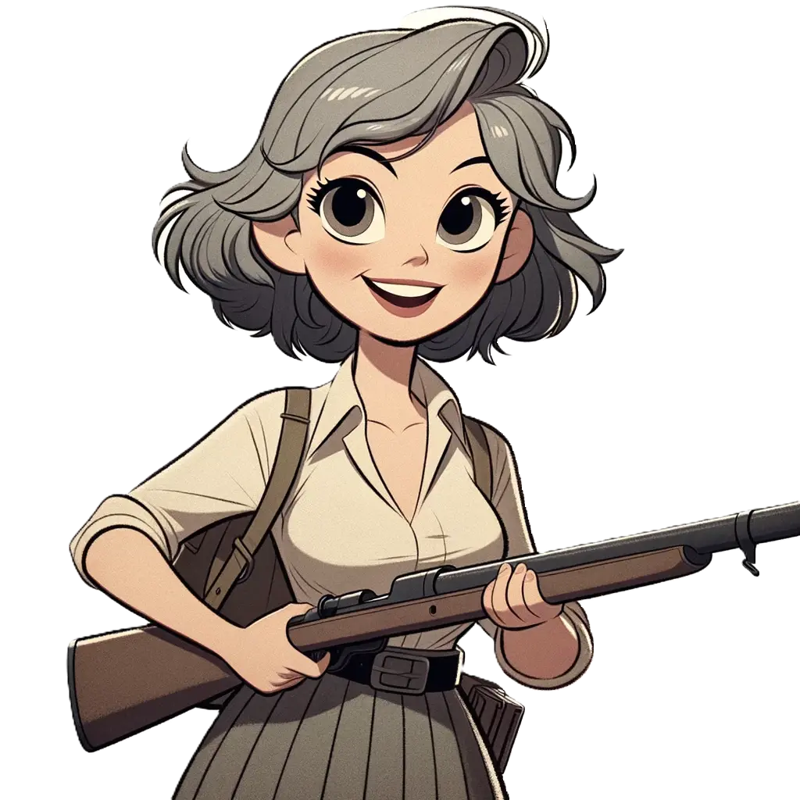
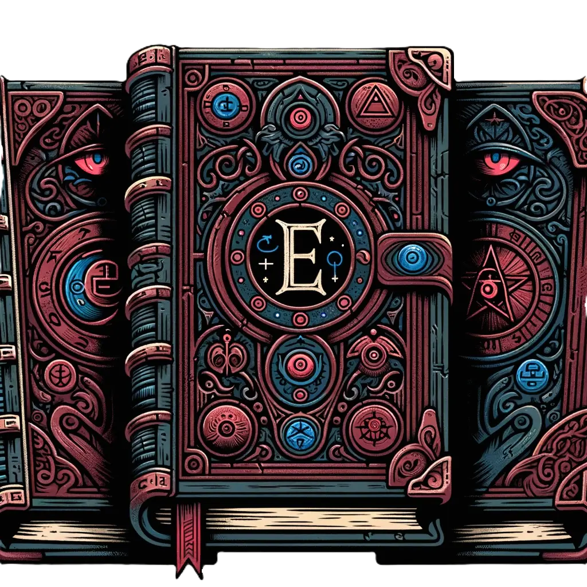

  
# STEAM ART  
  
[Graphical Assets - Overview (Steamworks Documentation)](https://partner.steamgames.com/doc/store/assets)  
  
# ACHIEVEMENTS  
  
## CONCEPT ART  
  
### AVERAGE ANNIE  
  
  
  
### WYNN  
  
  
  
## ANIMATIONS  
  
### MAINSTREAM MARK VOMIT  
  
### AVERAGE ANNIE WALK  
  
### AVERAGE ANNIE RUN AND SCREAM  
  
### AVERAGE ANNIE VOMIT  
  
### ARROW ANIMATION  
  
# PROPS  
  
## PUMPKIN SPICE LATTE  
  
## CELL PHONE  
  
## UI  
  
### BUG BUTTON  
  
  
  
### EVIL BOOK ICON  
  
  
  
  
  
# GAME WORLD  
  
## ARMOR ICON  
  
  
  
### ARROW  
  
* To navigate up and down levels.  
  
## SIDE BAR  
