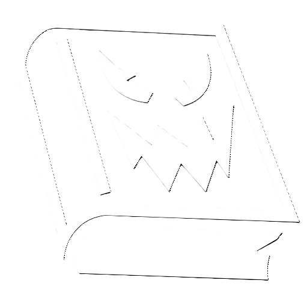
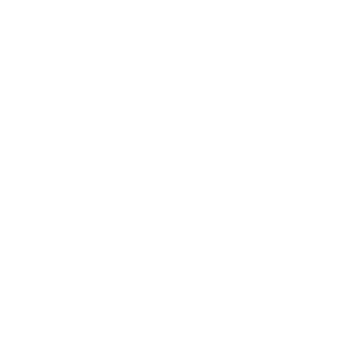

  
# STEAM ART  
  
[Graphical Assets - Overview (Steamworks Documentation)](https://partner.steamgames.com/doc/store/assets)  
  
## STORE ASSETS  
  
[Store Graphical Assets Details & Templates](https://partner.steamgames.com/doc/store/assets/standard) - These are the capsules and assets needed when constructing your Steam store page.  
  
| **Header Capsule**   | Required | 920px x 430px   Just your game logo and artwork [See details](https://partner.steamgames.com/doc/store/assets/standard#header_capsule)                   |  
| -------------------- | -------- | ----------------------------------------------------------------------------------------------------------------------------------------------------------- |  
| **Small Capsule**    | Required | 462px x 174px   Just your game logo and artwork [See details](https://partner.steamgames.com/doc/store/assets/standard#small_capsule)                    |  
| **Main Capsule**     | Required | 1232px x 706px   Just your game logo and artwork [See details](https://partner.steamgames.com/doc/store/assets/standard#main_capsule)                    |  
| **Vertical Capsule** | Required | 748px x 896px   Just your game logo and artwork [See details](https://partner.steamgames.com/doc/store/assets/standard#hero_capsule)                     |  
| **Screenshots**      | Required | 1920px x 1080px or other 16:9 ratio preferred. Any size supported.   [See details](https://partner.steamgames.com/doc/store/assets/standard#screenshots) |  
| **Page Background**  | Optional | 1438px x 810px   Subtle artwork, not too bright [See details](https://partner.steamgames.com/doc/store/assets/standard#page_background)                  |  
| **Bundle Images**    | Optional | Bundle assets required if you set up a bundle   [See details](https://partner.steamgames.com/doc/store/assets/standard#bundles)                          |  
  
## LIBRARY ASSETS  
  
[Library Assets Details & Templates](https://partner.steamgames.com/doc/store/assets/libraryassets) - These are the capsules and graphics needed for the Steam Library presentation of your game.  
  
|   |   |   |  
|---|---|---|  
|**Library Capsule**|Required|600px x 900px   Just your game logo and artwork [See details](https://partner.steamgames.com/doc/store/assets/libraryassets#capsule)|  
|**Library Hero**|Required|3840px x 1240px .png   Just your game artwork [See details](https://partner.steamgames.com/doc/store/assets/libraryassets#hero)|  
|**Library Logo**|Required|1280px x 720px .png   Just your game logo. Will be displayed on top of Hero Graphic. [See details](https://partner.steamgames.com/doc/store/assets/libraryassets#logo)|  
|**Library Header Capsule**|Required|920px x 430px   Just your game logo and artwork [See details](https://partner.steamgames.com/doc/store/assets/libraryassets#header_capsule)|  
  
## ACHIEVEMENTS  
  
* TBD  
  
## CONCEPT ART  
  
### AVERAGE ANNIE  
  
  
  
### WYNN  
  
  
  
## ANIMATIONS  
  
### MAINSTREAM MARK VOMIT  
  
### AVERAGE ANNIE WALK  
  
### AVERAGE ANNIE RUN AND SCREAM  
  
### AVERAGE ANNIE VOMIT  
  
### ARROW ANIMATION  
  
# PROPS  
  
## PUMPKIN SPICE LATTE  
  
## CELL PHONE  
  
## UI  
  
### BUG BUTTON  
  
  
  
### EVIL BOOK ICON  
  
  
  
  
  
# GAME WORLD  
  
## ARMOR ICON  
  
  
  
### ARROW  
  
* To navigate up and down levels.  
  
## SIDE BAR BACKGROUND  
